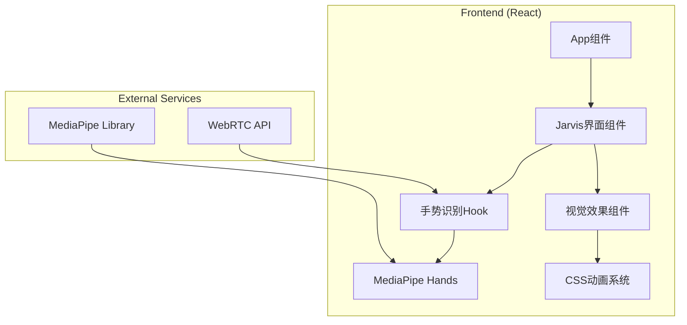
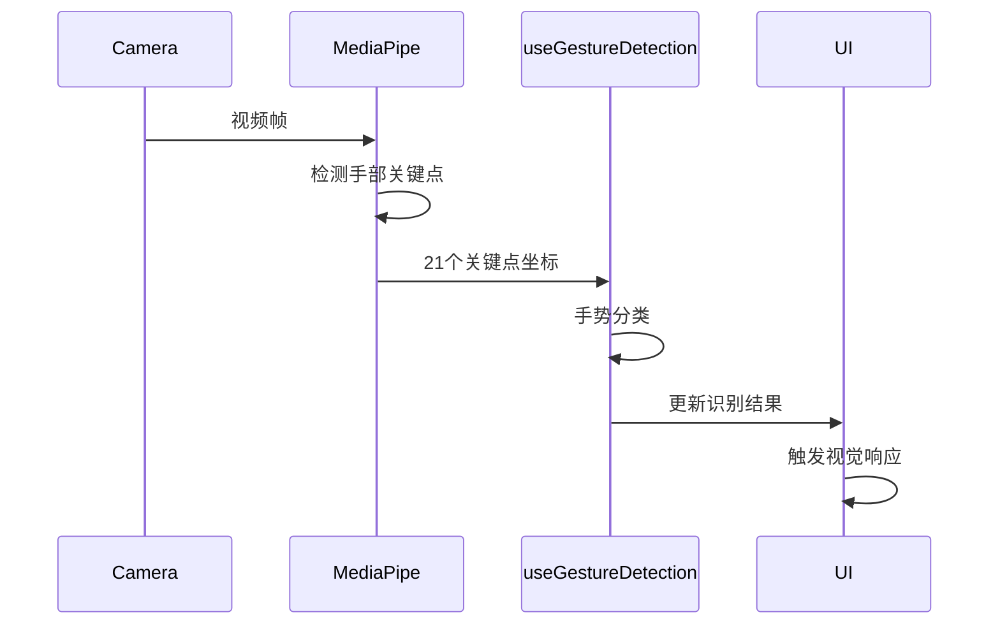

## 1. Architecture Design


## 2. Technology Description
- Frontend: React@18 + TypeScript + tailwindcss@3 + vite
- Initialization Tool: vite-init
- Backend: None
- 手势识别: MediaPipe Hands
- 视觉效果: 原生CSS动画 + Canvas粒子系统

## 3. Route Definitions
| Route | Purpose |
|-------|---------|
| / | 贾维斯主界面 |

## 4. Core Components
### 4.1 Component Structure
```
src/
├── components/
│   ├── JarvisUI.tsx          # 主界面组件
│   ├── GestureCamera.tsx     # 手势摄像头组件
│   ├── StatusPanel.tsx       # 状态面板
│   ├── CentralVisual.tsx     # 中央可视化
│   ├── CommandPanel.tsx      # 命令面板
│   └── ParticleSystem.tsx    # 粒子系统
├── hooks/
│   └── useGestureDetection.ts # 手势识别Hook
├── utils/
│   └── gestureClassifier.ts   # 手势分类器
├── App.tsx
└── main.tsx
```

### 4.2 Type Definitions
```typescript
// 手势类型定义
type GestureType = 
  | 'open_palm'      // 张开手掌
  | 'point_up'       // 指向上方
  | 'point_left'     // 指向左
  | 'point_right'    // 指向右
  | 'thumbs_up'      // 大拇指向上
  | 'thumbs_down'    // 大拇指向下
  | 'peace'          // 剪刀手
  | 'fist'           // 拳头
  | 'unknown';       // 未知

// 手势识别结果
interface GestureResult {
  gesture: GestureType;
  confidence: number;
  landmarks: number[][]; // 21个手部关键点
}

// 应用状态
interface AppState {
  isCameraActive: boolean;
  currentGesture: GestureResult | null;
  gestureHistory: GestureResult[];
  systemStatus: {
    time: string;
    network: 'online' | 'offline';
    cpu: number;
    memory: number;
  };
}
```

## 5. Gesture Recognition Flow


## 6. Performance Considerations
- 使用Web Worker处理手势识别计算
- 限制识别频率为15fps，避免性能问题
- Canvas粒子系统使用requestAnimationFrame
- 响应式设计确保各设备流畅运行
