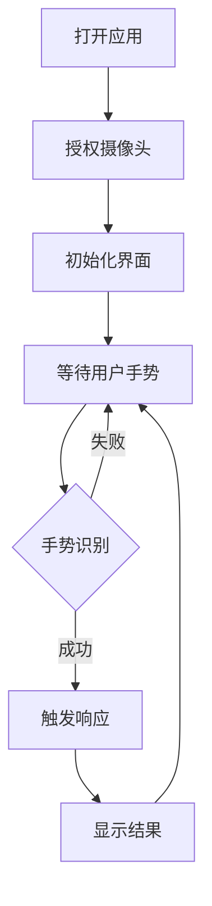

## 1. Product Overview
贾维斯（Jarvis）手势控制界面，一个具有未来感的AI助手界面，通过摄像头识别用户手势并作出响应。
- 为用户提供沉浸式的未来科技体验，结合视觉效果与交互设计
- 目标是打造一个美观、实用且具有现代科技美学的演示应用

## 2. Core Features

### 2.1 Feature Module
1. **主界面**: 未来科技风格的贾维斯界面，包含状态显示、信息面板、动画效果
2. **手势识别**: 实时摄像头手势检测与识别
3. **响应系统**: 根据不同手势触发相应的视觉和功能响应

### 2.3 Page Details
| Page Name | Module Name | Feature description |
|-----------|-------------|---------------------|
| 主界面 | 状态显示区 | 实时显示系统状态、时间、信息 |
| 主界面 | 中央可视化 | 动态可视化效果，展示系统活动 |
| 主界面 | 手势识别区 | 摄像头预览和手势识别结果展示 |
| 主界面 | 命令面板 | 显示可用手势命令和功能说明 |

## 3. Core Process
用户打开应用 → 授权摄像头访问 → 系统初始化并显示贾维斯界面 → 用户在摄像头前做手势 → 系统识别手势 → 显示识别结果并触发相应响应 → 持续交互循环

## 4. User Interface Design
### 4.1 Design Style
- 主色调：深蓝色 (#0A192F) + 亮青色 (#64FFDA)
- 按钮风格：霓虹边框、发光效果、圆形设计
- 字体：Orbitron (主标题) + Roboto Mono (内容)
- 布局风格：全屏沉浸式、网格背景、未来科技元素
- 动画：脉冲效果、扫描线、数据流动画

### 4.2 Page Design Overview
| Page Name | Module Name | UI Elements |
|-----------|-------------|-------------|
| 主界面 | 背景 | 深蓝色网格 + 扫描线动画 + 光晕效果 |
| 主界面 | 状态显示 | 左上角：时间和系统状态；右上角：网络和摄像头状态 |
| 主界面 | 中央可视化 | 动态脉冲圆环 + 粒子系统 + 数据流效果 |
| 主界面 | 手势识别 | 右下角：摄像头预览 + 手势骨架 + 识别结果 |
| 主界面 | 命令面板 | 左侧：可用手势列表 + 图标说明 |

### 4.3 Responsiveness
桌面端：全屏沉浸式体验，利用大屏幕展示丰富视觉效果
平板：适配居中布局，保持主要功能完整性
移动端：简化界面，核心功能保留，优化触控体验

### 4.4 Visual Effects Guidance
- 环境氛围：深邃科技感，类似钢铁侠实验室
- 灯光：霓虹青蓝色为主，红色警告色为辅
- 动画：持续的背景粒子流动、脉冲效果、扫描线
- 交互反馈：手势识别时高亮显示，响应时有波纹扩散效果
- 视觉层次：模糊玻璃态面板、发光边框、投影效果
